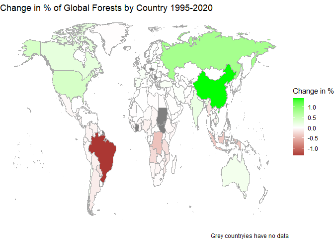

TidyTemplate
================
2021-04-05

# TidyTuesday

Join the R4DS Online Learning Community in the weekly \#TidyTuesday
event! Every week we post a raw dataset, a chart or article related to
that dataset, and ask you to explore the data. While the dataset will be
“tamed”, it will not always be tidy! As such you might need to apply
various R for Data Science techniques to wrangle the data into a true
tidy format. The goal of TidyTuesday is to apply your R skills, get
feedback, explore other’s work, and connect with the greater \#RStats
community! As such we encourage everyone of all skills to participate!

# Load the weekly Data

Dowload the weekly data and make available in the `tt` object.

``` r
tt <- tt_load("2021-04-06")
```

    ## --- Compiling #TidyTuesday Information for 2021-04-06 ----

    ## --- There are 5 files available ---

    ## --- Starting Download ---

    ## 
    ##  Downloading file 1 of 5: `forest.csv`
    ##  Downloading file 2 of 5: `forest_area.csv`
    ##  Downloading file 3 of 5: `brazil_loss.csv`
    ##  Downloading file 4 of 5: `soybean_use.csv`
    ##  Downloading file 5 of 5: `vegetable_oil.csv`

    ## --- Download complete ---

# Readme

Take a look at the readme for the weekly data to get insight on the
dataset. This includes a data dictionary, source, and a link to an
article on the data.

``` r
tt
```

# Glimpse Data

Take an initial look at the format of the data available.

``` r
tt %>% 
  map(glimpse)
```

    ## Rows: 475
    ## Columns: 4
    ## $ entity                <chr> "Algeria", "Algeria", "Algeria", "Algeria", "Arg~
    ## $ code                  <chr> "DZA", "DZA", "DZA", "DZA", "ARG", "ARG", "ARG",~
    ## $ year                  <dbl> 1990, 2000, 2010, 2015, 1990, 2000, 2010, 2015, ~
    ## $ net_forest_conversion <dbl> -8800, 33900, 7600, -1400, -182600, -316400, -22~
    ## Rows: 7,846
    ## Columns: 4
    ## $ entity      <chr> "Afghanistan", "Afghanistan", "Afghanistan", "Afghanistan"~
    ## $ code        <chr> "AFG", "AFG", "AFG", "AFG", "AFG", "AFG", "AFG", "AFG", "A~
    ## $ year        <dbl> 1990, 1991, 1992, 1993, 1994, 1995, 1996, 1997, 1998, 1999~
    ## $ forest_area <dbl> 0.02852494, 0.02857782, 0.02863089, 0.02868416, 0.02873763~
    ## Rows: 13
    ## Columns: 14
    ## $ entity                          <chr> "Brazil", "Brazil", "Brazil", "Brazil"~
    ## $ code                            <chr> "BRA", "BRA", "BRA", "BRA", "BRA", "BR~
    ## $ year                            <dbl> 2001, 2002, 2003, 2004, 2005, 2006, 20~
    ## $ commercial_crops                <dbl> 280000, 415000, 550000, 747000, 328000~
    ## $ flooding_due_to_dams            <dbl> 0, 79000, 0, 26000, 17000, 17000, 9000~
    ## $ natural_disturbances            <dbl> 0, 35000, 35000, 22000, 26000, 26000, ~
    ## $ pasture                         <dbl> 1520000, 2568000, 2761000, 2564000, 26~
    ## $ selective_logging               <dbl> 96000, 96000, 149000, 131000, 140000, ~
    ## $ fire                            <dbl> 26000, 114000, 44000, 79000, 393000, 7~
    ## $ mining                          <dbl> 9000, 9000, 0, 0, 0, 0, 9000, 9000, 0,~
    ## $ other_infrastructure            <dbl> 9000, 13000, 9000, 13000, 13000, 9000,~
    ## $ roads                           <dbl> 13000, 31000, 35000, 57000, 35000, 170~
    ## $ tree_plantations_including_palm <dbl> 44000, 44000, 26000, 92000, 52000, 260~
    ## $ small_scale_clearing            <dbl> 249000, 293000, 358000, 415000, 288000~
    ## Rows: 9,897
    ## Columns: 6
    ## $ entity      <chr> "Africa", "Africa", "Africa", "Africa", "Africa", "Africa"~
    ## $ code        <chr> NA, NA, NA, NA, NA, NA, NA, NA, NA, NA, NA, NA, NA, NA, NA~
    ## $ year        <dbl> 1961, 1962, 1963, 1964, 1965, 1966, 1967, 1968, 1969, 1970~
    ## $ human_food  <dbl> 33000, 43000, 31000, 43000, 34000, 41000, 47000, 50000, 52~
    ## $ animal_feed <dbl> 6000, 7000, 7000, 6000, 6000, 6000, 6000, 7000, 6000, 6000~
    ## $ processed   <dbl> 14000, 17000, 5000, 14000, 12000, 2000, 4000, 3000, 6000, ~
    ## Rows: 143,832
    ## Columns: 5
    ## $ entity     <chr> "Afghanistan", "Afghanistan", "Afghanistan", "Afghanistan",~
    ## $ code       <chr> "AFG", "AFG", "AFG", "AFG", "AFG", "AFG", "AFG", "AFG", "AF~
    ## $ year       <dbl> 1961, 1961, 1961, 1961, 1961, 1961, 1961, 1961, 1961, 1961,~
    ## $ crop_oil   <chr> "Soybean", "Sesame", "Linseed", "Palm", "Rapeseed", "Ground~
    ## $ production <dbl> NA, 2253, 3531, NA, NA, NA, 4997, NA, 82, NA, 2938, NA, NA,~

    ## $forest
    ## # A tibble: 475 x 4
    ##    entity    code   year net_forest_conversion
    ##    <chr>     <chr> <dbl>                 <dbl>
    ##  1 Algeria   DZA    1990                -8800 
    ##  2 Algeria   DZA    2000                33900 
    ##  3 Algeria   DZA    2010                 7600 
    ##  4 Algeria   DZA    2015                -1400.
    ##  5 Argentina ARG    1990              -182600 
    ##  6 Argentina ARG    2000              -316400 
    ##  7 Argentina ARG    2010              -223400 
    ##  8 Argentina ARG    2015              -104800 
    ##  9 Aruba     ABW    1990                    0 
    ## 10 Aruba     ABW    2000                    0 
    ## # ... with 465 more rows
    ## 
    ## $forest_area
    ## # A tibble: 7,846 x 4
    ##    entity      code   year forest_area
    ##    <chr>       <chr> <dbl>       <dbl>
    ##  1 Afghanistan AFG    1990      0.0285
    ##  2 Afghanistan AFG    1991      0.0286
    ##  3 Afghanistan AFG    1992      0.0286
    ##  4 Afghanistan AFG    1993      0.0287
    ##  5 Afghanistan AFG    1994      0.0287
    ##  6 Afghanistan AFG    1995      0.0288
    ##  7 Afghanistan AFG    1996      0.0288
    ##  8 Afghanistan AFG    1997      0.0289
    ##  9 Afghanistan AFG    1998      0.0290
    ## 10 Afghanistan AFG    1999      0.0290
    ## # ... with 7,836 more rows
    ## 
    ## $brazil_loss
    ## # A tibble: 13 x 14
    ##    entity code   year commercial_crops flooding_due_to~ natural_disturb~ pasture
    ##    <chr>  <chr> <dbl>            <dbl>            <dbl>            <dbl>   <dbl>
    ##  1 Brazil BRA    2001           280000                0                0 1520000
    ##  2 Brazil BRA    2002           415000            79000            35000 2568000
    ##  3 Brazil BRA    2003           550000                0            35000 2761000
    ##  4 Brazil BRA    2004           747000            26000            22000 2564000
    ##  5 Brazil BRA    2005           328000            17000            26000 2665000
    ##  6 Brazil BRA    2006           188000            17000            26000 1861000
    ##  7 Brazil BRA    2007            79000             9000            22000 1577000
    ##  8 Brazil BRA    2008            52000                0            17000 1345000
    ##  9 Brazil BRA    2009            57000             9000            31000  847000
    ## 10 Brazil BRA    2010           100000                0            44000  616000
    ## 11 Brazil BRA    2011            52000            17000            87000  738000
    ## 12 Brazil BRA    2012           118000            17000            52000  546000
    ## 13 Brazil BRA    2013            87000                0            13000  695000
    ## # ... with 7 more variables: selective_logging <dbl>, fire <dbl>, mining <dbl>,
    ## #   other_infrastructure <dbl>, roads <dbl>,
    ## #   tree_plantations_including_palm <dbl>, small_scale_clearing <dbl>
    ## 
    ## $soybean_use
    ## # A tibble: 9,897 x 6
    ##    entity code   year human_food animal_feed processed
    ##    <chr>  <chr> <dbl>      <dbl>       <dbl>     <dbl>
    ##  1 Africa <NA>   1961      33000        6000     14000
    ##  2 Africa <NA>   1962      43000        7000     17000
    ##  3 Africa <NA>   1963      31000        7000      5000
    ##  4 Africa <NA>   1964      43000        6000     14000
    ##  5 Africa <NA>   1965      34000        6000     12000
    ##  6 Africa <NA>   1966      41000        6000      2000
    ##  7 Africa <NA>   1967      47000        6000      4000
    ##  8 Africa <NA>   1968      50000        7000      3000
    ##  9 Africa <NA>   1969      52000        6000      6000
    ## 10 Africa <NA>   1970      52000        6000      8000
    ## # ... with 9,887 more rows
    ## 
    ## $vegetable_oil
    ## # A tibble: 143,832 x 5
    ##    entity      code   year crop_oil        production
    ##    <chr>       <chr> <dbl> <chr>                <dbl>
    ##  1 Afghanistan AFG    1961 Soybean                 NA
    ##  2 Afghanistan AFG    1961 Sesame                2253
    ##  3 Afghanistan AFG    1961 Linseed               3531
    ##  4 Afghanistan AFG    1961 Palm                    NA
    ##  5 Afghanistan AFG    1961 Rapeseed                NA
    ##  6 Afghanistan AFG    1961 Groundnut               NA
    ##  7 Afghanistan AFG    1961 Cottonseed            4997
    ##  8 Afghanistan AFG    1961 Coconut (copra)         NA
    ##  9 Afghanistan AFG    1961 Olive, virgin           82
    ## 10 Afghanistan AFG    1961 Safflower               NA
    ## # ... with 143,822 more rows

# Wrangle

Explore the data and process it into a nice format for plotting! Access
each dataset by name by using a dollarsign after the `tt` object and
then the name of the data set.

``` r
world.map <- map_data("world")
world.map <- world.map %>% filter(region !='Antarctica')

f1991 <- tt$forest_area %>%
  dplyr::filter(year == 1995 ) %>%  #
  dplyr::rename(region = entity)  # Rename columns'


f2015 <- tt$forest_area %>%
  dplyr::filter(year == 2020 ) %>%  #
  dplyr::rename(region = entity)  # Rename columns

change <- left_join(f1991, f2015, by=c("region", "code"))
glimpse(change)
```

    ## Rows: 251
    ## Columns: 6
    ## $ region        <chr> "Afghanistan", "Africa", "Albania", "Algeria", "American~
    ## $ code          <chr> "AFG", NA, "ALB", "DZA", "ASM", NA, "AND", "AGO", "AIA",~
    ## $ year.x        <dbl> 1995, 1995, 1995, 1995, 1995, 1995, 1995, 1995, 1995, 19~
    ## $ forest_area.x <dbl> 2.879129e-02, 1.730720e+01, 1.856100e-02, 3.866826e-02, ~
    ## $ year.y        <dbl> 2020, 2020, 2020, 2020, 2020, 2020, 2020, 2020, 2020, 20~
    ## $ forest_area.y <dbl> 2.977235e-02, 1.568488e+01, 1.943614e-02, 4.801754e-02, ~

``` r
change<-change %>% drop_na(code) %>% rename(fa_1991=forest_area.x, fa_2015=forest_area.y) %>% select(region,fa_1991, fa_2015 ) %>% mutate(fa_change=((fa_2015-fa_1991)), .keep="all") %>%
 mutate(
    region = ifelse(region == "Antigua and Barbuda", "Antigua", region) 
    )  %>%
   mutate(
    region = ifelse(region == "United States", "USA", region) 
    )   %>%
   mutate(
    region = ifelse(region == "Congo", "Republic of Congo", region) 
    )  %>%
   mutate(
    region = ifelse(region == "Democratic Republic of Congo", "Democratic Republic of the Congo", region) 
    )  %>%
   mutate(
    region = ifelse(region == "Pitcairn", "Pitcairn Islands", region) 
    )  %>%
   mutate(
    region = ifelse(region == "United Kingdom", "UK", region) 
    )  %>%
   mutate(
    region = ifelse(region == "North Macedonia", "Macedonia", region) 
    )   %>%
   mutate(
    region = ifelse(region == "Saint Kitts and Nevis", "Saint Kitts", region) 
    )  %>%
   mutate(
    region = ifelse(region == "Saint Vincent and the Grenadine", "Saint Vincent", region) 
    )   %>%
   mutate(
    region = ifelse(region == "Timor", "Timor-Leste", region) 
    ) 

data.map<-left_join(world.map, change, by= "region")

change
```

    ## # A tibble: 217 x 4
    ##    region          fa_1991  fa_2015   fa_change
    ##    <chr>             <dbl>    <dbl>       <dbl>
    ##  1 Afghanistan    0.0288   0.0298    0.000981  
    ##  2 Albania        0.0186   0.0194    0.000875  
    ##  3 Algeria        0.0387   0.0480    0.00935   
    ##  4 American Samoa 0.000426 0.000422 -0.00000444
    ##  5 Andorra        0.000381 0.000394  0.0000130 
    ##  6 Angola         1.87     1.64     -0.229     
    ##  7 Anguilla       0.000131 0.000136  0.00000447
    ##  8 Antigua        0.000233 0.000200 -0.0000330 
    ##  9 Argentina      0.817    0.704    -0.113     
    ## 10 Armenia        0.00795  0.00809   0.000142  
    ## # ... with 207 more rows

``` r
summary(change)
```

    ##     region             fa_1991             fa_2015         
    ##  Length:217         Min.   :  0.00000   Min.   :  0.00000  
    ##  Class :character   1st Qu.:  0.00105   1st Qu.:  0.00113  
    ##  Mode  :character   Median :  0.03899   Median :  0.04745  
    ##                     Mean   :  0.91635   Mean   :  0.91702  
    ##                     3rd Qu.:  0.22363   3rd Qu.:  0.23568  
    ##                     Max.   :100.00000   Max.   :100.00000  
    ##    fa_change         
    ##  Min.   :-1.3449668  
    ##  1st Qu.:-0.0015388  
    ##  Median : 0.0000102  
    ##  Mean   : 0.0006710  
    ##  3rd Qu.: 0.0033505  
    ##  Max.   : 1.4391196

    world.regions <- world %>% select(region)
    world.regions <- unique(world.regions)

    change.regions <- change %>% select(region)
    change.regions <- unique(change.regions)

    missing.regions<-anti_join(change.regions, world.regions)

# Visualize

Using your processed dataset, create your unique visualization.

``` r
ggplot(data.map, aes(map_id = region, fill = fa_change))+
  geom_map(map = data.map,  color = "dark gray")+
  expand_limits(x = data.map$long, y = data.map$lat)+
  scale_fill_gradient2(low = "brown", mid = "white", high = "green", midpoint = 0.0102, label_value("Change in %"))+
  ggtitle(label="Change in % of Global Forests by Country 1995-2020")+
  labs(caption = "Grey countryies have no data")+
  
  theme_void()
```

<!-- --> \#
Save Image

Save your image for sharing. Be sure to use the `#TidyTuesday` hashtag
in your post on twitter!

``` r
# This will save your most recent plot
ggsave(
  filename = glue('{imgdir}tidytuesdayplot_{dt}.png'))
```

    ## Saving 7 x 5 in image
